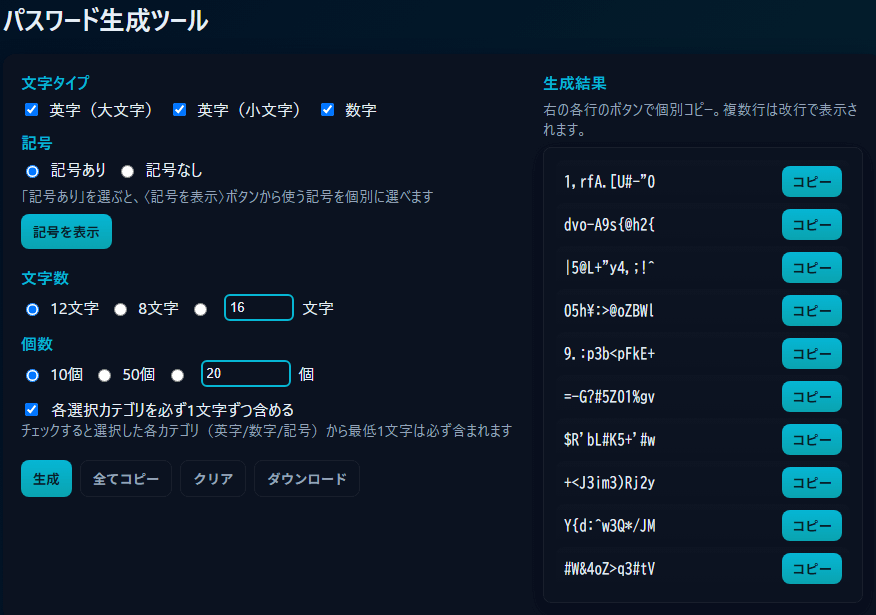

# パスワード生成ツール

## 概要
このパスワード生成ツールは、Web 上で簡単に安全なパスワードを生成できるツールです。  
英字（大文字・小文字）、数字、記号の種類や文字数、生成個数を自由に指定できます。

- 記号の種類は個別に選択可能
- PC・スマホ両対応のレスポンシブデザイン
- 生成後のパスワードはコピー、全コピー、ダウンロード可能

## デモ
[こちらのURLから閲覧できます](https://bonpurple.github.io/password-generator/)

## スクリーンショット

| PC表示 | スマホ表示 |
| ------ | ---------- |
|  |  |

## 使用方法
1. 文字タイプ（英字・数字・記号）を選択
2. 記号を使用する場合は、「記号を表示」で個別に選択
3. 文字数と生成個数を指定
4. 「各選択カテゴリを必ず1文字ずつ含める」を必要に応じてチェック
5. 「生成」ボタンをクリック
6. 出力されたパスワードは各行のコピーボタン、または「全てコピー」「ダウンロード」ボタンで利用可能

## 著作権について
このツールの HTML/CSS/JavaScript コードは、ChatGPT が生成したコードを元に、ユーザーが指示・編集して作成したものです。  
参考として [Luft Co., Ltd の randam.php](https://www.luft.co.jp/cgi/randam.php) をインスピレーションとして参考にしましたが、**直接コードをコピーしたものではありません**。  
したがって、このツールの著作権は作成者にあります。

## ライセンス
このプロジェクトは **MIT License** の下で公開されています。詳細は [LICENSE](./LICENSE) ファイルをご覧ください。
